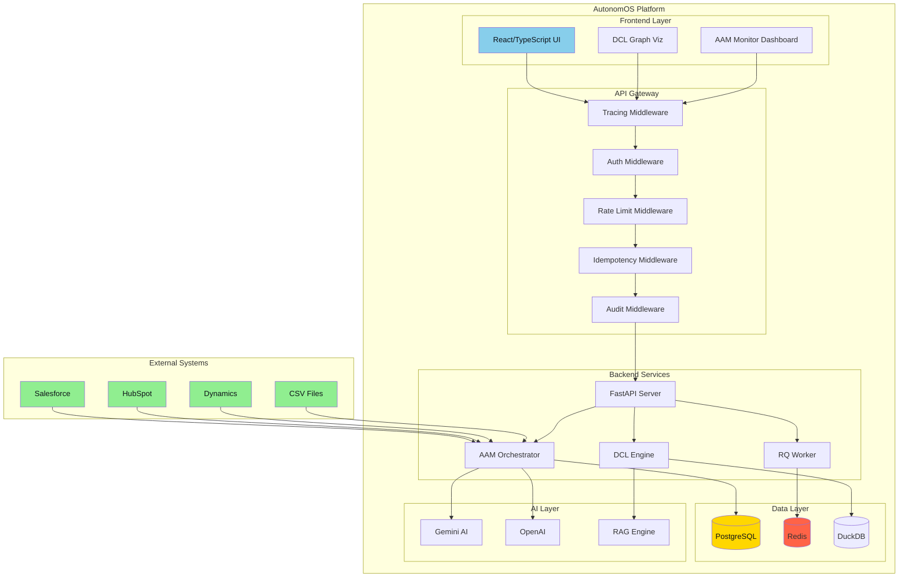
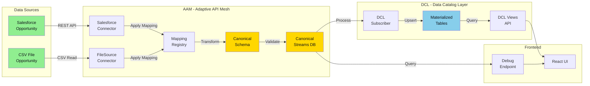
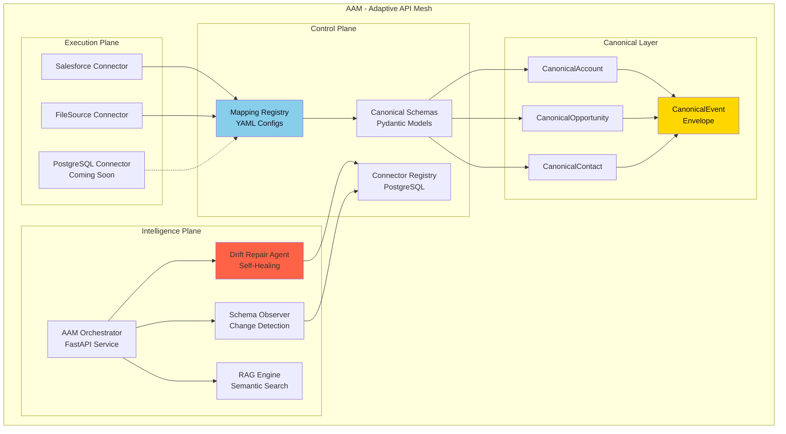
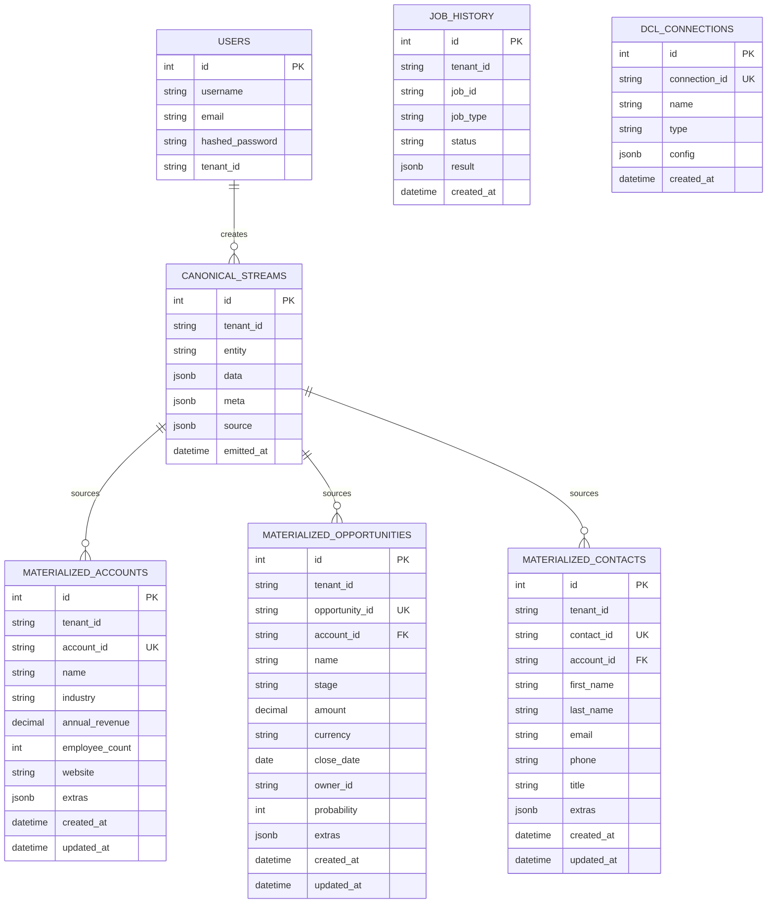
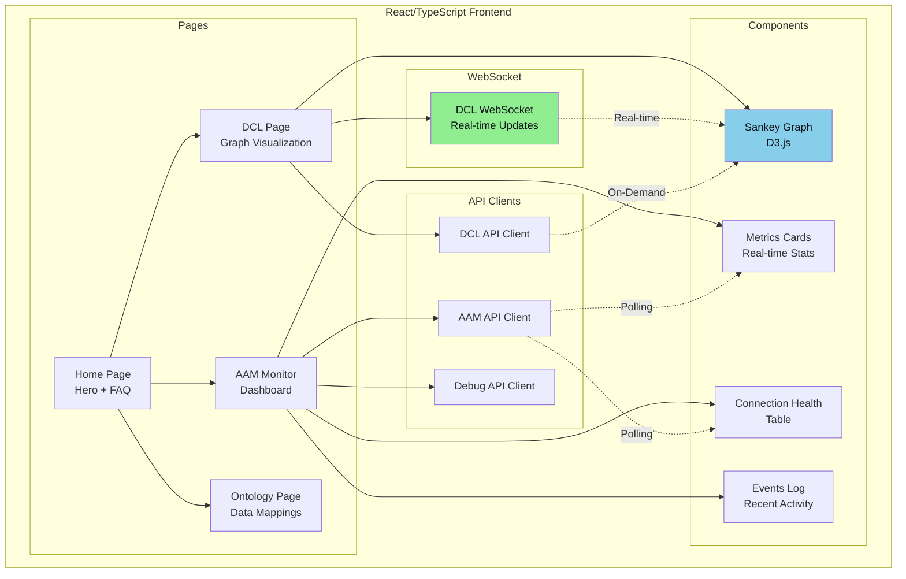
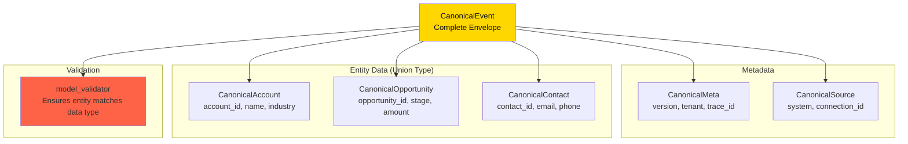
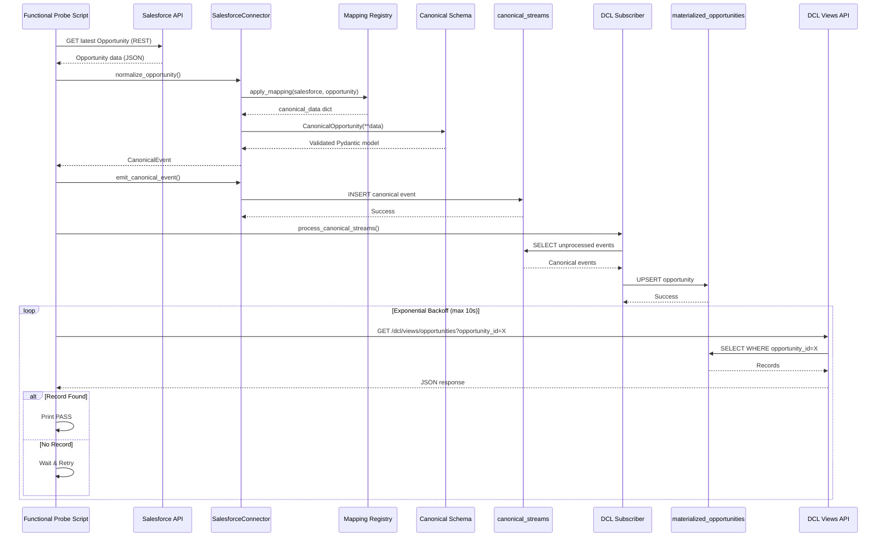

# AutonomOS Platform Architecture

## Table of Contents
1. [High-Level System Architecture](#high-level-system-architecture)
2. [Data Flow: Source → AAM → DCL](#data-flow-source--aam--dcl)
3. [AAM Components](#aam-components)
4. [Gateway Middleware Stack](#gateway-middleware-stack)
5. [Database Schema](#database-schema)
6. [Frontend Architecture](#frontend-architecture)

---

## High-Level System Architecture



---

## Data Flow: Source → AAM → DCL



---

## AAM Components



---

## Gateway Middleware Stack

```mermaid
graph TD
    REQ[Incoming HTTP Request]
    
    REQ --> MW1[1. Tracing Middleware<br/>Generate trace_id]
    MW1 --> MW2[2. Auth Middleware<br/>JWT validation, tenant extraction]
    MW2 --> MW3[3. Rate Limit Middleware<br/>Per-tenant rate limiting]
    MW3 --> MW4[4. Idempotency Middleware<br/>Prevent duplicate requests]
    MW4 --> MW5[5. Audit Middleware<br/>Log all actions]
    
    MW5 --> ROUTE{Route?}
    
    ROUTE -->|/api/v1/auth| AUTH[Auth Endpoints]
    ROUTE -->|/api/v1/aoa| AOA[AOA Orchestration]
    ROUTE -->|/api/v1/aam| AAM[AAM Monitoring]
    ROUTE -->|/api/v1/filesource| FS[FileSource API]
    ROUTE -->|/api/v1/dcl/views| DCL_V[DCL Views API]
    ROUTE -->|/api/v1/debug| DEBUG[Debug Endpoints<br/>DEV_DEBUG=true]
    ROUTE -->|/dcl| DCL[DCL Engine]
    ROUTE -->|/| STATIC[Static Frontend]

    subgraph "Public Endpoints (Bypass Auth)"
        PUB1[/docs, /health]
        PUB2[/api/v1/auth/login]
        PUB3[/dcl/ws, /dcl/state]
        PUB4[/api/v1/aam/*]
        PUB5[/api/v1/debug/*]
    end

    style MW1 fill:#E6E6FA,color:#0D1117
    style MW2 fill:#FFB6C1,color:#0D1117
    style MW3 fill:#FFE4B5,color:#0D1117
    style MW4 fill:#B0E0E6,color:#0D1117
    style MW5 fill:#98FB98,color:#0D1117
    style DEBUG fill:#FF6347
```

---

## Database Schema



---

## Frontend Architecture



---

## Canonical Schema Type Hierarchy



---

## Functional Probe Flow



---

## Key Design Patterns

### 1. **Multi-Tenancy**
- Every table has `tenant_id` for data isolation
- JWT tokens carry `tenant_id` for automatic scoping
- Middleware enforces tenant-based access control

### 2. **Strict Typing with Pydantic**
- `CanonicalEvent.data` is a Union of typed models
- `@model_validator` ensures entity type matches data
- Required fields enforced at event creation time

### 3. **Event-Driven Architecture**
- Connectors emit canonical events to streams
- DCL subscriber processes streams asynchronously
- WebSocket broadcasts state changes to frontend

### 4. **Idempotency**
- Trace IDs track request lifecycles
- Idempotency middleware prevents duplicate operations
- Upsert logic in DCL prevents duplicate data

### 5. **Feature Flags**
- `DEV_DEBUG` enables debug endpoints
- `FEATURE_USE_FILESOURCE` toggles FileSource connector
- `FEATURE_DRIFT_AUTOFIX` controls auto-repair

---

## Technology Stack Summary

| Layer | Technology |
|-------|-----------|
| **Frontend** | React, TypeScript, Vite, D3.js |
| **Backend** | FastAPI, Python 3.11, Uvicorn |
| **Database** | PostgreSQL (Replit), DuckDB (DCL) |
| **Cache/Queue** | Redis, Python RQ |
| **AI/LLM** | Gemini 2.5, OpenAI, RAG (multilingual-e5) |
| **Auth** | JWT (HS256), Argon2 password hashing |
| **Deployment** | Replit, Nix environment |

---

## Component Count Summary

- **Backend Microservices:** 5 (API, DCL, AAM Orchestrator, Worker, Auth Broker)
- **Connectors:** 2 (Salesforce, FileSource) + 1 planned (PostgreSQL)
- **Middleware Layers:** 5 (Tracing, Auth, Rate Limit, Idempotency, Audit)
- **API Endpoints:** 20+ (Auth, AOA, AAM, DCL, FileSource, Debug)
- **Database Tables:** 8+ (Users, CanonicalStreams, 3× Materialized, JobHistory, etc.)
- **Canonical Entities:** 3 (Account, Opportunity, Contact)
- **Frontend Pages:** 4 (Home, DCL, AAM Monitor, Ontology)
- **WebSocket Channels:** 1 (DCL real-time updates)

---

This architecture supports:
- ✅ Multi-tenant data isolation
- ✅ Strict type safety with Pydantic
- ✅ Real-time UI updates via WebSocket
- ✅ Self-healing connectivity (AAM Drift Repair)
- ✅ Semantic search with RAG
- ✅ Comprehensive audit trail
- ✅ Production-ready security (JWT, rate limiting)
