# AutonomOS Platform Architecture

## Table of Contents
1. [Functional Overview](#functional-overview)
2. [Systems Overview (AOA)](#systems-overview-aoa)
3. [High-Level System Architecture](#high-level-system-architecture)
4. [Data Flow: Source → AAM → DCL](#data-flow-source--aam--dcl)
5. [AAM Components](#aam-components)
6. [Gateway Middleware Stack](#gateway-middleware-stack)
7. [Database Schema](#database-schema)
8. [Frontend Architecture](#frontend-architecture)
9. [Canonical Schema Types](#canonical-schema-types)
10. [Technology Stack](#technology-stack)

---

## Functional Overview

**What AutonomOS Does:** Connects messy data sources, cleans them up intelligently, and gives AI agents a unified view.

```mermaid
flowchart TB
    DS["📊 DATA SOURCES<br/><br/><b>Function:</b> Provide raw business data<br/><br/><b>What they do:</b><br/>• Salesforce stores CRM data<br/>• Supabase tracks product usage<br/>• MongoDB logs customer events<br/>• CSV files hold legacy data<br/><br/><b>Problem:</b> Different formats,<br/>field names, structures"]
    
    AAM["🔧 ADAPTIVE API MESH<br/><br/><b>Function:</b> Normalize chaos into order<br/><br/><b>What it does:</b><br/>• Connects to each source<br/>• Transforms to standard format<br/>• Detects schema changes<br/>• Auto-repairs broken mappings<br/>• Uses AI to match similar fields<br/><br/><b>Output:</b> Clean, validated,<br/>canonical events"]
    
    DCL["📚 DATA CATALOG LAYER<br/><br/><b>Function:</b> Create unified queryable views<br/><br/><b>What it does:</b><br/>• Stores canonical events<br/>• Builds materialized tables<br/>• Links related records<br/>• Infers relationships<br/>• Provides SQL-like queries<br/><br/><b>Output:</b> Single source of truth<br/>for all business entities"]
    
    AGENTS["🤖 AI AGENTS<br/><br/><b>Function:</b> Take intelligent action<br/><br/><b>What they do:</b><br/>• RevOps: Score deals, predict revenue<br/>• FinOps: Find cost anomalies<br/>• Query unified data (no ETL)<br/>• Execute actions automatically<br/>• Write back to sources<br/><br/><b>Result:</b> Automated insights<br/>and actions"]
    
    DS -->|"Raw events<br/>(messy, inconsistent)"| AAM
    AAM -->|"Canonical events<br/>(clean, validated)"| DCL
    DCL -->|"Unified data<br/>(queryable, linked)"| AGENTS
    AGENTS -->|"Actions<br/>(update, alert, optimize)"| AAM
```

**Key Functional Benefits:**

1. **Data Sources** → No integration work needed. Connect once, data flows automatically.
2. **AAM** → Self-healing. When Salesforce adds a field, AAM detects and adapts automatically.
3. **DCL** → Query all sources as one. No more writing separate queries for each system.
4. **Agents** → Built on unified data. Write logic once, works across all sources.

**Example Flow:**
- Salesforce emits "Opportunity closed" → AAM normalizes to CanonicalOpportunity → DCL materializes in unified view → RevOps agent calculates pipeline health → Agent updates forecast in Salesforce

---

## Systems Overview (AOA)

**Agentic Orchestration Architecture** - The complete data flow from sources to AI agents.

**Key Data Flow:**
1. **Sources** emit raw events (account.created, opportunity.updated)
2. **AAM** normalizes to canonical schema with drift detection
3. **DCL** materializes queryable views
4. **Gateway** provides secure API access
5. **Agents** query unified data and take actions

---

## High-Level System Architecture

---

## Data Flow: Source → AAM → DCL

---

## AAM Components

**Adaptive API Mesh** - Three-plane architecture for intelligent data connectivity.

**Current Connectors:**
- ✅ Salesforce (Production)
- ✅ Supabase (Production)
- ✅ MongoDB (Production)
- ✅ FileSource (Production)

---

## Gateway Middleware Stack

---

## Database Schema

---

## Frontend Architecture

**Frontend Pages:**
- **Home** - Hero section + FAQ
- **DCL Graph** - Interactive Sankey visualization
- **AAM Monitor** - Intelligence metrics, connection health
- **Ontology** - Data mappings and universe view
- **Live Flow** - Real-time event visualization with animated pills

---

## Canonical Schema Types

**Canonical Entities:**
- `CanonicalAccount` - Account records
- `CanonicalOpportunity` - Sales opportunities
- `CanonicalContact` - Contact information

All wrapped in `CanonicalEvent` envelope with metadata and source tracking.

---

## Technology Stack

| Layer | Technology |
|-------|-----------|
| **Frontend** | React, TypeScript, Vite, D3.js, Framer Motion |
| **Backend** | FastAPI, Python 3.11, Uvicorn |
| **Database** | PostgreSQL (Replit), DuckDB (DCL) |
| **Cache/Queue** | Redis, Python RQ |
| **AI/LLM** | Gemini 2.5 Flash, RAG (multilingual-e5) |
| **Auth** | JWT (HS256), Argon2 |
| **Deployment** | Replit, Nix |

---

## Current Statistics

- **Connectors:** 4 (Salesforce, Supabase, MongoDB, FileSource)
- **Frontend Pages:** 5 (Home, DCL, AAM, Ontology, Live Flow)
- **Middleware Layers:** 5 (Tracing, Auth, Rate Limit, Idempotency, Audit)
- **Canonical Entities:** 3 (Account, Opportunity, Contact)
- **Database Tables:** 8+ (Users, Streams, Materialized views, etc.)

---

**Platform Capabilities:**
- ✅ Multi-tenant data isolation
- ✅ Real-time event visualization (Live Flow)
- ✅ Self-healing connectivity (AAM Drift Repair)
- ✅ Semantic field matching (RAG)
- ✅ Production-ready security (JWT, rate limiting)
- ✅ Comprehensive audit trail
